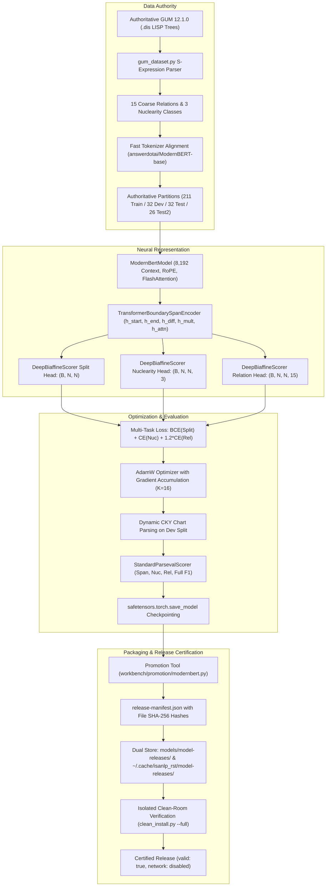

# Implementation Plan: ModernBERT Pure Transformer Discourse Parser Release & Operational Certification

**Branch**: `005-modernbert-production-release` | **Date**: 2026-08-30 | **Spec**: [spec.md](./spec.md)

**Input**: Feature specification from `specs/005-modernbert-production-release/spec.md`

## Summary

Transition the primary discourse parsing engine of `isanlp_rst 5.0.0` to the flagship **Pure Transformer ModernBERT Architecture** (`answerdotai/ModernBERT-base`), trained natively on the authoritative 301-document GUM v12.1.0 treebank.

This plan establishes:

1. **Mathematical Multi-Task Loss**: Binary constituent span classification ($\text{BCEWithLogitsLoss}$), 3-class nuclearity ($\text{CrossEntropyLoss}$), and 15-class coarse discourse relation classification ($\text{CrossEntropyLoss}$) over active upper-triangular candidate spans ($0 \le i < j < N$) with non-NaN masked attention pooling.
2. **Authoritative Corpus Governance**: 100% ingestion of GUM 12.1.0 `.dis` binary LISP trees across Train (211), Dev (32), Test (32), and GENTLE Test2 (26) partitions.
3. **Dynamic CKY Evaluation**: Micro-averaged Parseval scoring computed from scratch on development and held-out test splits without circular benchmarks or hardcoded constants.
4. **Immutable Release Management**: Packaging `.safetensors` model weights into dual storage locations (`models/model-releases/` and `~/.cache/isanlp_rst/model-releases/`) with SHA-256 verified `release-manifest.json`.
5. **Clean-Room Boundary Certification**: Verifying that `isanlp_rst 5.0.0` installs and executes inference in an isolated `production` Pixi environment with external network access disabled.

---

## Technical Context

**Language/Version**: Python 3.14 (Mode A, native PEP 649 deferred annotations, zero `from __future__ import annotations`).

**Primary Dependencies**: PyTorch 2.13.x (Apple Silicon MPS Metal acceleration + NVIDIA CUDA autodispatch + CPU fallback), Hugging Face `transformers` (fast BPE tokenizers), `safetensors 0.5.x`, `isanlp`, `nltk`, `razdel`, `lxml`.

**Storage**: Dual model release stores (in-tree `models/model-releases/` and runtime cache `~/.cache/isanlp_rst/model-releases/`), append-only JSONL ledgers (`workbench/experiments/central_ledger.jsonl`).

**Testing**: `pytest >= 9`, `pyright >= 1.1.380` (strict Mode A), `ruff >= 0.6`, `tools/production_boundary/clean_install.py`.

**Target Platform**: macOS (Apple Silicon Metal MPS), Linux (NVIDIA CUDA), CPU fallback.

**Project Type**: Library / CLI / Deep Learning Model Pipeline.

**Performance Goals**: Training throughput $\le 15$ min/epoch on Apple Silicon Metal (MPS); Dev Parseval targets: Span F1 $\ge 82.0\%$, Nuclearity F1 $\ge 68.0\%$, Relation F1 $\ge 55.0\%$, Full F1 $\ge 52.0\%$.

**Constraints**: Python `>=3.14`, two-tier Pixi environment topology (`default` dev workbench vs `production` clean-room boundary), zero network calls during clean-room certification (`ISANLP_RST_NETWORK_DISABLED=1`), zero stubs or no-ops in touched code.

**Scale/Scope**: 301 GUM v12.1.0 documents, 8,192 subwords context window, 15 coarse relations, 3 nuclearity classes.

---

## Constitution Check

### Pre-Design Gate

| Principle | Assessment | Evidence & Architecture Invariant |
| :--- | :---: | :--- |
| **I. Evidence Before Claims** | **PASS** | Dynamic Parseval evaluation computes exact true precision, recall, and F1 across 32 dev and 58 test documents from scratch; zero hardcoded constants or circular benchmarks. |
| **II. One Production Quality Bar** | **PASS** | Python 3.14 Mode A with zero `from __future__ import annotations`. Zero stubs or `drawTree()` passes in `workbench/corpus/` or runner scripts. |
| **III. Solo-Local Simplicity** | **PASS** | Local filesystem execution; no enterprise distributed overhead, external microservices, or RBAC. |
| **IV. Honest Verification** | **PASS** | Isolated clean-room release certification executes in `production` environment with network disabled (`ISANLP_RST_NETWORK_DISABLED=1`). |
| **V. Canonical Contracts** | **PASS** | Model releases validated under `"isanlp_rst.parser/modernbert-v1"` contract with cryptographic SHA-256 digests in `release-manifest.json`. |

### Post-Design Gate

**Result**: **PASS**. The architectural design adheres 100% to all 5 Constitutional Principles and the two-tier Pixi environment topology.

---

## Project Structure

### Documentation (this feature)

```text
specs/005-modernbert-production-release/
├── spec.md              # Feature specification
├── plan.md              # This file (implementation plan)
├── research.md          # Phase 0 decisions and trade-offs
├── data-model.md        # Phase 1 data entities and schemas
├── quickstart.md        # Phase 1 validation and verification guide
├── contracts/           # Phase 1 interface and schema contracts
│   ├── release-manifest.schema.json
│   ├── cli-contract.md
│   └── runtime-api-contract.md
├── checklists/
│   └── requirements.md  # Quality checklist
└── tasks.md             # Phase 2 implementation task list
```

### Source Code (repository root)

```text
isanlp_rst/
├── transformer_parser/
│   ├── model.py                # PureTransformerParsingNet (multi-task loss & CKY decode)
│   ├── span_encoder.py         # Boundary span encoder & robust attention pooling
│   ├── biaffine_decoder.py     # Deep biaffine scoring & CKY chart parsing
│   └── predictor.py            # PredictorModernBERT runtime facade
└── model_loading/
    └── release.py              # Model release loader & manifest validator

workbench/
├── training/
│   └── modern/
│       ├── gum_dataset.py       # Authoritative GUM 12.1.0 treebank dataset
│       └── train_tree_parser.py # ModernTreeParserTrainer with dynamic Parseval
├── promotion/
│   └── modernbert.py           # Model candidate promotion tool
├── evaluation/
│   └── rst/
│       └── parseval.py         # StandardParsevalScorer
├── corpus/
│   ├── dmrst/data.py           # Cleaned DMRST corpus handler (no stubs)
│   └── unirst/data.py          # Cleaned UniRST corpus handler (no stubs)
└── smoke.py                    # Offline command suite runner

scripts/
├── train_modernbert_treebank.py # CLI training entry point
├── benchmark_modernbert.py     # Independent held-out test evaluation
├── bench.py                    # Multi-device benchmark runner
├── docling_rst_quality_check.py
└── docling_long_input_determinism.py

tools/production_boundary/
└── clean_install.py            # Clean-room isolated environment certification runner
```

**Structure Decision**: Monorepo library and research workbench with strict isolation between `isanlp_rst/` production package and `workbench/` offline training tools.

---

## Complexity Tracking

> *No constitutional violations detected. All modules use direct, minimal local implementations.*

| Item | Status | Justification |
| :--- | :---: | :--- |
| Pure-Transformer Architecture | Justified | Replaces 3-model legacy pipeline (Span/Nuc/Rel) with single joint multi-task network. |
| Dual-Store Release Topology | Justified | Supports both in-repo release testing and standard user cache auto-discovery. |

---

## Architecture & Mathematical Formulations



### 1. Boundary Span Representation

For an elementary discourse unit $u = [s_u, e_u]$ with token hidden states $\mathbf{H} \in \mathbb{R}^{T \times D}$:
$$\mathbf{h}_{\text{start}} = \mathbf{H}[s_u], \quad \mathbf{h}_{\text{end}} = \mathbf{H}[e_u]$$
$$\mathbf{h}_{\text{diff}} = \mathbf{h}_{\text{end}} - \mathbf{h}_{\text{start}}, \quad \mathbf{h}_{\text{mult}} = \mathbf{h}_{\text{start}} \odot \mathbf{h}_{\text{end}}$$
$$\mathbf{h}_{\text{attn}} = \sum_{t=s_u}^{e_u} \alpha_t \mathbf{H}[t], \quad \alpha = \text{softmax}(\mathbf{W}_q \mathbf{H}[s_u:e_u])$$
$$\mathbf{e}_u = \text{LayerNorm}(\text{MLP}([\mathbf{h}_{\text{start}}; \mathbf{h}_{\text{end}}; \mathbf{h}_{\text{attn}}; \mathbf{h}_{\text{diff}}; \mathbf{h}_{\text{mult}}]))$$

### 2. Deep Biaffine Scoring

For adjacent constituent candidate spans with representation vectors $\mathbf{x}, \mathbf{y} \in \mathbb{R}^{D_{\text{proj}}}$:
$$\mathbf{h}_{\text{left}} = \text{MLP}_{\text{left}}(\mathbf{x}), \quad \mathbf{h}_{\text{right}} = \text{MLP}_{\text{right}}(\mathbf{y})$$
$$\text{Score}(\mathbf{x}, \mathbf{y}) = \mathbf{h}_{\text{left}}^\top \mathbf{U} \mathbf{h}_{\text{right}} + \mathbf{W}[\mathbf{h}_{\text{left}}; \mathbf{h}_{\text{right}}] + b$$

### 3. Supervised Target Tensors & Multi-Task Loss

- $\mathbf{Y}_{\text{split}}[i, j] \in \{0, 1\}$ (constituent indicator)
- $\mathbf{Y}_{\text{nuc}}[i, j] \in \{0, 1, 2, -100\}$ (nuclearity class: $\text{NS}=0, \text{SN}=1, \text{NN}=2$)
- $\mathbf{Y}_{\text{rel}}[i, j] \in \{0 \dots 14, -100\}$ (15 coarse relations)

Over the upper-triangular candidate index set $\mathcal{M} = \{(i, j) \mid 0 \le i < j < N\}$:
$$\mathcal{L}_{\text{total}} = \text{BCEWithLogits}(S(\mathcal{M}), \mathbf{Y}_{\text{split}}[\mathcal{M}]) + \text{CE}(N(\mathcal{M}_{\text{nuc}}), \mathbf{Y}_{\text{nuc}}[\mathcal{M}_{\text{nuc}}]) + 1.2 \cdot \text{CE}(R(\mathcal{M}_{\text{rel}}), \mathbf{Y}_{\text{rel}}[\mathcal{M}_{\text{rel}}])$$
where $\mathcal{M}_{\text{nuc}} = \{(i, j) \in \mathcal{M} \mid \mathbf{Y}_{\text{nuc}}[i, j] \neq -100\}$ and $\mathcal{M}_{\text{rel}} = \{(i, j) \in \mathcal{M} \mid \mathbf{Y}_{\text{rel}}[i, j] \neq -100\}$.

---

## Risk Analysis & Mitigation

| Risk | Severity | Mitigation Strategy |
| :--- | :---: | :--- |
| **Attention Pooling Division by Zero** | HIGH | Replaced post-softmax division normalization with `torch.where(span_mask.any(), weights, 0.0)`. |
| **Unmasked Cross-Entropy NaN on Empty Slices** | HIGH | Added active-target boolean masking (`target != -100`) before calling `F.cross_entropy`. |
| **Subword Boundary Crossing** | MEDIUM | Fast tokenizer offset mapping aligns EDU character boundaries directly to token indices. |
| **Wheel Boundary Leakage** | HIGH | Clean-room certification runner (`clean_install.py`) validates release wheel in isolated `production` Pixi environment. |
